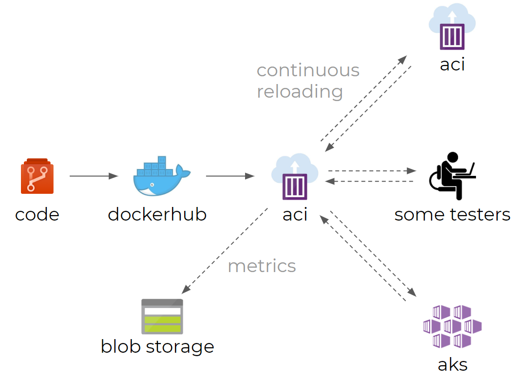

# [pbi-testing](/README.md)

A nodejs **server** that serves an embedded powerbi dashboard that keeps refreshing itself, sending render-time metrics of all connected **client(s)** back to the server, and writing them out to blob storage.



It's merely a infrastructural shell around the original [microsoft/PowerBI-Tools-For-Capacities](https://github.com/microsoft/PowerBI-Tools-For-Capacities) project to scale up/out, and a [`Makefile`](Makefile) allowing anyone to jump right in and fire up some stress tests.

**Prerequisites:** wsl / linux, make, node, yarn, az-cli (last version), docker, Azure Resource Group, Azure Container Registry

## 1. Development

The [`Makefile`](Makefile) contains all required commands for building, publishing and deploying to Azure Container Instances / Azure Kubernetes Service.

1. Run `make install` (requires `yarn` and `node`)
1. Start the server:
   ```bash
   export PORT=3000
   export DEBUG=True
   make dev
   ```
1. Repeat step 2 after changing any javascript code.
   Simply refresh your browser tab (using `CTRL + SHIFT + R`) when you're only modifying html / css
1. Dockerize your changes (requires `docker`):
   ```bash
   make dockerize
   ```
1. Spin up a container to see whether it functions properly:
   ```bash
   make run-locally
   ```
1. Push the changes to a docker registry (create the RG and registry manually, update the variables in the `Makefile`, you may have to run `az login` and `az acr login --name <acrname>` first):
   ```bash
   make publish
   ```
1. Deploy your image to ACI (Azure Container Instances):
   ```bash
   make deploy-server
   ```

## 2. Server Usage

The server requires two things:

- [`public/reports.json`](public/reports.json) - a dictionary, containing report definitions as described in the original project: [link](https://github.com/microsoft/PowerBI-Tools-For-Capacities/tree/master/RealisticLoadTestTool)
- [`private/token.json`](private/token.json) - a token (that expires after 60 minutes) is required, which can be generated using the [`generate_token.ps1`](private/generate_token.ps1) powershell script

1. Generate a token:
   ```bash
   make generate-token
   ```
   or on Windows:
   ```bash
   powershell ./private/generate_token.ps1
   ```
1. Deploy the solution, following the steps in [1. Development](#1-development)
1. If you haven't changed the `NAME` variable in the [`Makefile`](Makefile), you should be able to visit your powerbi tester page under: http://pbi-tester.westeurope.azurecontainer.io
1. Importing the [`postman/postman_collection.json`](postman/postman_collection.json) file in [Postman](https://www.postman.com/), so you can interact with the server using the following endpoints:
   - GET [`/report`](http://localhost:3000/report) - Get available report definitions
   - POST [`/report/:id`](https://www.postman.com/) - Create / overwrite report definition by id
   - DEL [`/report/:id`](https://www.postman.com/) - Delete report definition by id
   - POST [`/start/:id`](https://www.postman.com/) - Post a fresh token and select a report definition by id to start a test
   - POST [`/stop`](https://www.postman.com/) - Clear token and active report

## 3. Server Metrics Logging

After you've set a token and active report using the `/start/:id` POST endpoint, you should see that the dashboard starts refreshing itself over and over.

The refresh-time metrics of your browser are logged to a file in [`logs/log.json`](logs/log.json) inside your mounted storage account:

```json
{ "tabId": "05d45e65-789b", "loadCounter":1, "avgDuration":3.066, "currDuration":3.066, "thinkTimeSeconds":1, "timeStamp":"2020-06-30T13:54:57.750Z" },
{ "tabId": "05d45e65-789b", "loadCounter":2, "avgDuration":2.401, "currDuration":1.736, "thinkTimeSeconds":1, "timeStamp":"2020-06-30T13:55:00.485Z" },
```

## 4. Client Usage

Clients are loyal subjects with the single task of loading the webpage that is served by the server, as you demonstrated in [3. Server Metrics Logging](#3-Server-Metrics-Logging). And as the image at the top of this readme suggests, it could be anything or anyone, but the simplest and most scalable option will be: `Kubernetes`.

1. Create a cluster and deploy a number of clients (defined in the `Makefile`):
   ```bash
   make deploy-client
   ```
1. Make sure the right report definition is set, and the token has been refreshed
1. You may want to rename or delete any existing log file, as the metrics will simply be appended to any log file that already exists

## Improvements

Done:

- Improve script for tabs to wait until server becomes available so that a restart is not required
- Improve kubernetes deployment for performance / configurability
  - configurable url in Makefile
  - configurable number of clients in Makefile
- Making the url configurable for the `menziess/pbi-tab` container
  - through env variables k8s
  - through websockets
- Store multiple report definitions in single file
- Show no token / report error on dashboard page
- Improve local debug deployment
  - spin up both server and client
  - allow host access to server + client simultaneously
  - allow simple server with `n` number of local tabs
- Add endpoints to configure server after it's deployed
  - add endpoint to crud report definitions
  - add endpoint to start and stop tests
  - add endpoint to update token
  - allow automatic refresh through websockets at client side
  - add postman collection
- style consistency through editorconfig
- Fix the `az aks create` command in the Makefile (use exported template, convert to `az` commands)

Must have:

- Log pbi filter as part of metric
- Fix cause of deleted and malformed lines in log file

Nice to have:

- Improve kubernetes deployment for performance / configurability
  - Starting multiple tabs per `pbi-tab` container (`firefox url1 url2 url3`) in Makefile
- Using Web Workers to prevent background tabs to become idle (required for the above)
- Create UI page from which report definitions and token can be maintained (usability feature)
- Create UI page from which AKS clusters can be maintained (usability feature)
- change `log.json` to `YYYY-MM-DD HH:MM:SS.json`
