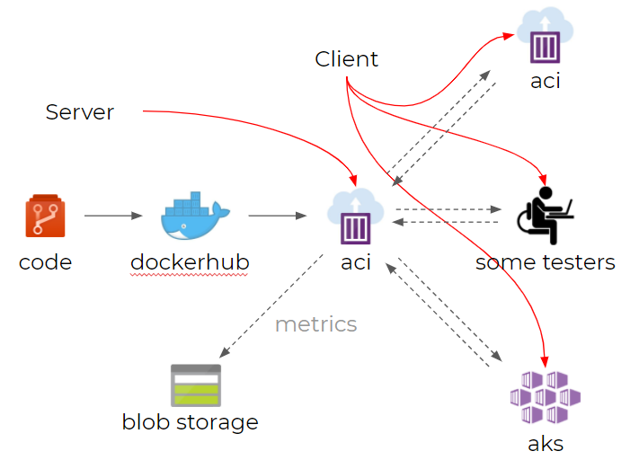

# [pbi-testing](/README.md)

Special thanks to [DavidMagarMS's](https://github.com/microsoft/PowerBI-Tools-For-Capacities/commits?author=DavidMagarMS) - [microsoft/PowerBI-Tools-For-Capacities](https://github.com/microsoft/PowerBI-Tools-For-Capacities).

A nodejs **server** that serves a webpage with an embedded powerbi dashboard that keeps refreshing itself, sending back render-time metrics -- of whichever **client(s)** that visit the page -- to the server via websockets, which are then written to blob storage.



This project contains all required components for setting up a "realistic" stress test for a single PowerBI report (based off of [microsoft/PowerBI-Tools-For-Capacities](https://github.com/microsoft/PowerBI-Tools-For-Capacities)), where the report can be loaded by many clients by browsing to a webpage that is hosted by a nodejs webserver that requires a single token. The clients can be replicated as containers in a kubernetes cluster, as Azure Container Instances, or simply by human beings opening browser tabs. The data is stored as lines of json, containing (average) refresh times, timestamps, and browser tab id's.

## 1. Development

The [`Makefile`](Makefile) contains all required commands for building, publishing and deploying to Azure Container Instances.

1. Run `make install` (requires `yarn` and `node`)
1. Start the server:
   ```bash
   export PORT=3000
   make dev
   ```
   or on Windows:
   ```cmd
   set PORT=3000
   node src/server.js
   ```
1. Repeat step 2 after changing any server-side code.
   Simply refresh your browser tab (using `CTRL + SHIFT + R`) when you're only modifying client-side code.
1. Dockerize your changes (requires docker)
   ```bash
   make dockerize
   ```
1. Spin up a container to see whether it functions
   ```bash
   make run
   ```
1. Push the changes to a docker registry
   ```bash
   make publish
   ```
1. Deploy your image to ACI (Azure Container Instances)
   ```bash
   make deploy-server
   ```

## 2. Server Usage

The server requires two things:

- [`public/reports.json`](public/reports.json) - a dictionary, containing report definitions as described in the original project: [link](https://github.com/microsoft/PowerBI-Tools-For-Capacities/tree/master/RealisticLoadTestTool)
- [`private/token.json`](private/token.json) - a token (that expires after 60 minutes) is required, which can be generated using the [`generate_token.ps1`](private/generate_token.ps1) powershell script

1. Generate a token:
   ```bash
   make generate-token
   ```
   or on Windows:
   ```bash
   powershell ./private/generate_token.ps1
   ```
1. Deploy the solution, following the steps in [Development](#1.-development)
1. If you haven't changed the `NAME` variable in the [`Makefile`](Makefile), you should be able to visit your powerbi tester page under: http://pbi-tester.westeurope.azurecontainer.io
1. Importing the [`postman/postman_collection.json`](postman/postman_collection.json) file in [Postman](https://www.postman.com/), so you can interact with the server using the following endpoints:
   - GET [`/report`](http://localhost:3000/report) - Get available report definitions
   - POST [`/report/:id`](https://www.postman.com/) - Create / overwrite report definition by id
   - DEL [`/report/:id`](https://www.postman.com/) - Delete report definition by id
   - POST [`/start/:id`](https://www.postman.com/) - Post a fresh token and select a report definition by id to start a test
   - POST [`/stop`](https://www.postman.com/) - Clear token and active report

## 3. Server Metrics Logging

Any client that tried to access your powerbi tester page under: http://pbi-tester.westeurope.azurecontainer.io will now see that their page has refreshed, and the powerbi dashboard is refreshing over and over and over again.

The metrics are logged to a file in [`logs/log.json`](logs/log.json) into your storage account:

```json
{"tabId":"05d45e65-789b","loadCounter":1,"avgDuration":3.066,"currDuration":3.066,"thinkTimeSeconds":1,"timeStamp":"2020-06-30T13:54:57.750Z"},
{"tabId":"05d45e65-789b","loadCounter":2,"avgDuration":2.401,"currDuration":1.736,"thinkTimeSeconds":1,"timeStamp":"2020-06-30T13:55:00.485Z"},
```

## 4. Client Usage

If you want to test the report on a greater scale, Kubernetes is the best way forward.

A container has been developed that -- on startup -- opens a firefox tab with url `http://pbi-tester.westeurope.azurecontainer.io`.

1. Make sure that the server has an [active token](#2.%20Server%20Usage)
2. Create one or multiple containers using container instances, a kubernetes cluster `make deploy-client`, or run locally: `make run-client`
3. Monitor the CPU / memory / network usage to simulate typical browser tabs for the stress test

## Improvements

- Fix the `az aks create` command in the Makefile
- Multiple report endpoints
- Making the url configurable for the `menziess/pbi-tab` container
  - through env variables k8s
  - through websockets
- Starting multiple tabs per `pbi-tab` container
- Using Web Workers to prevent background tabs to become idle
- Improve script for tabs to wait until server becomes available so that a restart is not required
- Improve kubernetes deployment for performance reasons
